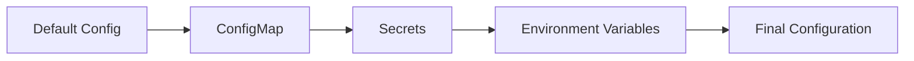

# Configuration Management

Guide to configuring ${{values.app_name}} for different environments.

## Configuration Strategy

### Configuration Layers

1. **Default Configuration**: Built into application
2. **ConfigMap**: Environment-specific settings
3. **Secrets**: Sensitive information
4. **Environment Variables**: Runtime overrides


## ConfigMap

### Structure
```yaml
apiVersion: v1
kind: ConfigMap
metadata:
  name: ${{values.app_name}}-config
  namespace: ${{values.app_name}}
  labels:
    app: ${{values.app_name}}
    environment: ${{values.app_env}}
data:
  # Application Settings
  APP_ENV: "${{values.app_env}}"
  APP_NAME: "${{values.app_name}}"
  PORT: "8080"
  
  # Logging Configuration
  LOG_LEVEL: "INFO"
  LOG_FORMAT: "json"
  
  # Feature Flags
  ENABLE_METRICS: "true"
  ENABLE_TRACING: "false"
  
  # Performance Settings
  WORKERS: "4"
  THREADS: "2"
  TIMEOUT: "30"
```

### Create ConfigMap
```bash
# From file
kubectl create configmap ${{values.app_name}}-config \
  --from-file=config.yaml \
  -n ${{values.app_name}}

# From literal values
kubectl create configmap ${{values.app_name}}-config \
  --from-literal=APP_ENV=${{values.app_env}} \
  --from-literal=PORT=8080 \
  -n ${{values.app_name}}

# From manifest
kubectl apply -f k8s/configmap.yaml
```

### Update ConfigMap
```bash
# Edit directly
kubectl edit configmap ${{values.app_name}}-config \
  -n ${{values.app_name}}

# Apply updated manifest
kubectl apply -f k8s/configmap.yaml

# Restart pods to pick up changes
kubectl rollout restart deployment/${{values.app_name}} \
  -n ${{values.app_name}}
```

## Secrets

### Structure
```yaml
apiVersion: v1
kind: Secret
metadata:
  name: ${{values.app_name}}-secret
  namespace: ${{values.app_name}}
  labels:
    app: ${{values.app_name}}
type: Opaque
data:
  # Base64 encoded values
  API_KEY: YXBpLWtleS12YWx1ZQ==
  DATABASE_PASSWORD: cGFzc3dvcmQ=
  JWT_SECRET: and0LXNlY3JldC1rZXk=
```

### Create Secret
```bash
# From literal values
kubectl create secret generic ${{values.app_name}}-secret \
  --from-literal=API_KEY=your-api-key \
  --from-literal=DATABASE_PASSWORD=your-password \
  -n ${{values.app_name}}

# From file
kubectl create secret generic ${{values.app_name}}-secret \
  --from-file=api-key.txt \
  -n ${{values.app_name}}

# From manifest
kubectl apply -f k8s/secret.yaml
```

### Encode Secrets
```bash
# Encode value
echo -n "your-secret-value" | base64

# Decode value
echo "eW91ci1zZWNyZXQtdmFsdWU=" | base64 -d
```

### Using External Secrets (Recommended)
```yaml
apiVersion: external-secrets.io/v1beta1
kind: ExternalSecret
metadata:
  name: ${{values.app_name}}-external-secret
  namespace: ${{values.app_name}}
spec:
  refreshInterval: 1h
  secretStoreRef:
    name: aws-secrets-manager
    kind: SecretStore
  target:
    name: ${{values.app_name}}-secret
  data:
  - secretKey: API_KEY
    remoteRef:
      key: ${{values.app_name}}/api-key
  - secretKey: DATABASE_PASSWORD
    remoteRef:
      key: ${{values.app_name}}/db-password
```

## Environment-Specific Configuration

### Development Environment
```yaml
# configmap-dev.yaml
apiVersion: v1
kind: ConfigMap
metadata:
  name: ${{values.app_name}}-config
  namespace: ${{values.app_name}}
data:
  APP_ENV: "development"
  LOG_LEVEL: "DEBUG"
  ENABLE_METRICS: "false"
  ENABLE_TRACING: "true"
  DEBUG_MODE: "true"
```

### Staging Environment
```yaml
# configmap-staging.yaml
apiVersion: v1
kind: ConfigMap
metadata:
  name: ${{values.app_name}}-config
  namespace: ${{values.app_name}}
data:
  APP_ENV: "staging"
  LOG_LEVEL: "INFO"
  ENABLE_METRICS: "true"
  ENABLE_TRACING: "true"
  DEBUG_MODE: "false"
```

### Production Environment
```yaml
# configmap-prod.yaml
apiVersion: v1
kind: ConfigMap
metadata:
  name: ${{values.app_name}}-config
  namespace: ${{values.app_name}}
data:
  APP_ENV: "production"
  LOG_LEVEL: "WARNING"
  ENABLE_METRICS: "true"
  ENABLE_TRACING: "true"
  DEBUG_MODE: "false"
  WORKERS: "8"
```

## Configuration Files

### Mount ConfigMap as File
```yaml
apiVersion: apps/v1
kind: Deployment
spec:
  template:
    spec:
      containers:
      - name: ${{values.app_name}}
        volumeMounts:
        - name: config-volume
          mountPath: /etc/config
          readOnly: true
      volumes:
      - name: config-volume
        configMap:
          name: ${{values.app_name}}-config
          items:
          - key: app-config.yaml
            path: config.yaml
```

### Application Config File
```yaml
# app-config.yaml
app:
  name: ${{values.app_name}}
  environment: ${{values.app_env}}
  port: 8080

logging:
  level: INFO
  format: json
  output: stdout

metrics:
  enabled: true
  port: 9090
  path: /metrics

features:
  rate_limiting: true
  caching: false
  async_processing: true
```

## Feature Flags

### Using ConfigMap
```yaml
data:
  FEATURE_NEW_ENDPOINT: "true"
  FEATURE_ASYNC_PROCESSING: "false"
  FEATURE_CACHING: "true"
```

### In Application Code
```python
import os

def is_feature_enabled(feature_name):
    return os.getenv(feature_name, "false").lower() == "true"

# Usage
if is_feature_enabled("FEATURE_NEW_ENDPOINT"):
    # Enable new endpoint
    pass
```

## Dynamic Configuration

### ConfigMap Reload
```python
import os
import time
from watchdog.observers import Observer
from watchdog.events import FileSystemEventHandler

class ConfigReloadHandler(FileSystemEventHandler):
    def on_modified(self, event):
        if event.src_path == "/etc/config/config.yaml":
            print("Configuration file changed, reloading...")
            load_config()

def watch_config():
    observer = Observer()
    observer.schedule(ConfigReloadHandler(), "/etc/config", recursive=False)
    observer.start()
    
watch_config()
```

## Configuration Validation

### Validation Script
```python
import os
import sys

REQUIRED_VARS = [
    "APP_ENV",
    "APP_NAME",
    "PORT"
]

def validate_config():
    missing = []
    for var in REQUIRED_VARS:
        if not os.getenv(var):
            missing.append(var)
    
    if missing:
        print(f"ERROR: Missing required configuration: {', '.join(missing)}")
        sys.exit(1)
    
    print("Configuration validation passed")

if __name__ == "__main__":
    validate_config()
```

### Init Container for Validation
```yaml
spec:
  initContainers:
  - name: config-validator
    image: python:3.11-slim
    command: ["python", "/scripts/validate_config.py"]
    envFrom:
    - configMapRef:
        name: ${{values.app_name}}-config
    volumeMounts:
    - name: scripts
      mountPath: /scripts
```

## Best Practices

### 1. Separation of Concerns

- **ConfigMaps**: Non-sensitive configuration
- **Secrets**: Sensitive data
- **Environment Variables**: Runtime overrides

### 2. Naming Conventions
```yaml
# Use consistent prefixes
APP_*          # Application settings
DB_*           # Database settings
CACHE_*        # Cache settings
FEATURE_*      # Feature flags
```

### 3. Documentation

Always document configuration options:
```yaml
data:
  # Maximum number of worker processes (default: 4)
  WORKERS: "4"
  
  # Request timeout in seconds (default: 30)
  TIMEOUT: "30"
  
  # Enable debug mode (default: false)
  # WARNING: Never enable in production
  DEBUG_MODE: "false"
```

### 4. Version Control
```bash
# Never commit secrets
echo "*.secret.yaml" >> .gitignore

# Use templates for secrets
cp secret.template.yaml secret.yaml
# Edit secret.yaml with actual values
```

### 5. Encryption at Rest

Enable encryption for secrets:
```yaml
apiVersion: v1
kind: EncryptionConfiguration
resources:
  - resources:
    - secrets
    providers:
    - aescbc:
        keys:
        - name: key1
          secret: <base64-encoded-secret>
    - identity: {}
```

## Troubleshooting

### ConfigMap Not Loading
```bash
# Verify ConfigMap exists
kubectl get configmap ${{values.app_name}}-config -n ${{values.app_name}}

# View ConfigMap contents
kubectl describe configmap ${{values.app_name}}-config -n ${{values.app_name}}

# Check pod environment
kubectl exec <pod-name> -n ${{values.app_name}} -- env | grep APP_
```

### Secret Not Accessible
```bash
# Check secret exists
kubectl get secret ${{values.app_name}}-secret -n ${{values.app_name}}

# Decode secret value
kubectl get secret ${{values.app_name}}-secret -n ${{values.app_name}} \
  -o jsonpath='{.data.API_KEY}' | base64 -d
```

### Configuration Not Updating
```bash
# Force pod restart
kubectl rollout restart deployment/${{values.app_name}} -n ${{values.app_name}}

# Delete and recreate pods
kubectl delete pods -l app=${{values.app_name}} -n ${{values.app_name}}
```

## Next Steps

- [Environment Variables](environment.md)
- [Kubernetes Deployment](kubernetes.md)
- [Security Best Practices](../operations/troubleshooting.md)